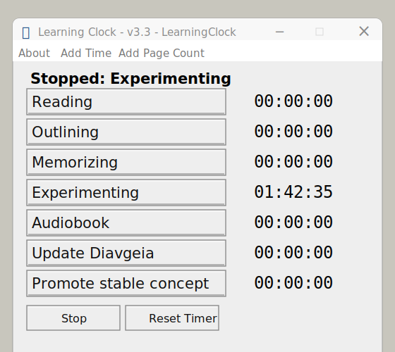
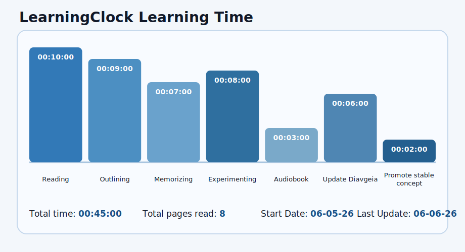
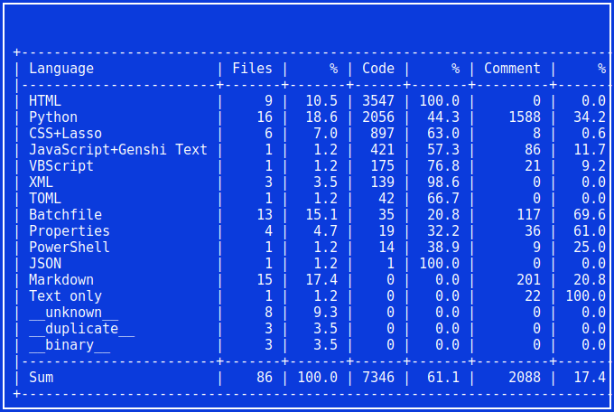

# LearningClock

LearningClock is a Windows-friendly Python/Tkinter desktop timer for tracking focused learning sessions. It records time across named study activities, page counts, session metadata, recovered emergency saves, and a recalculated CSV `TOTAL` row that can feed reports and Diavgeia documentation.

It is inspired by **dual timers chess clocks**. As soon as a player makes a moove stops his timer which starts his opponent timer. Similarly that Learning Clock has 7 such timers that track the different stages of learning. For example, I can start with reading, and as soon as hit the outlining timer, the reading timer stops and the outliner starts.

The project is intentionally small and operational: the GUI owns timer behavior, `CsvStore` owns persistence, tests protect the CSV contract, and `scripts/dev.py` provides repeatable lifecycle commands for development, QA, coverage, packaging, Diavgeia export, and production release.

## Application And Dashboard

The desktop app presents seven learning timers that map directly to the persisted CSV activity columns.



The Obsidian/Diavgeia dashboard reads the CSV and renders the aggregate learning-time graph from `diavgeia/LearningClock/Learning-Clock-Dashboard.md`.



## What Is Implemented

- Tkinter desktop timer with activity switching, stop/reset controls, manual time entry, and page-count entry.
- CSV persistence with a stable schema, canonical date formatting, activity-to-column mapping, page totals, and final aggregate `TOTAL` row.
- Existing CSV normalization for legacy dates and legacy field names.
- Emergency CSV save/recovery path for shutdown failures.
- Diagnostic logging beside the configured CSV output.
- Package CLI health check and version command.
- Compatibility launcher for the historical `learning-clock.py` entry path.
- Unit tests for CSV behavior and focused regression tests for real/app-style CSV inputs.
- Default `clock-QA` regression fixture under `build\Clock-QA` so the complete pytest suite runs without skipped CSV regression tests.
- HTML coverage generation through a convenience command.
- Diavgeia Markdown source pages and export tooling.
- Production release script that copies the runnable launcher/runtime files to `D:\LearningPath\Tools\LearningClock`.

## Documentation

- [Requirements](docs/requirements.md)
- [Quick Start](docs/quick-start.md)
- [Usage](docs/usage.md)
- [Source Code Structure](docs/source-code-structure.md)
- [CSV Contract](docs/csv-contract.md)
- [Tests and Default Clock-QA Regression Fixture](docs/tests.md)
- [Coverage](docs/coverage.md)
- [Coverage Report](https://javaboy-vk.github.io/LearningClock/)
- [Convenience Commands](docs/convenience-commands.md)
- [Production Release, Packaging, and Generated Output Policy](docs/production-release.md)
- [Obsidian-Diavgeia Documentation](docs/obsidian-diavgeia-documentation.md)
- [VS Code Support](docs/vscode-support.md)
- [Automated Code Inventory](docs/code-inventory-automation.md)

## Code Inventory

This snapshot is generated by:

```cmd
scripts\pygount-summary.cmd
```


