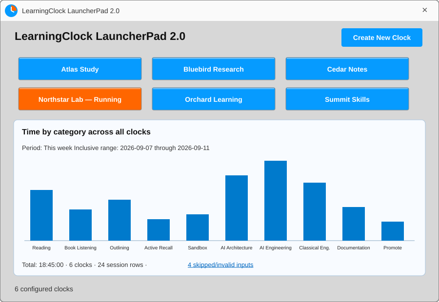
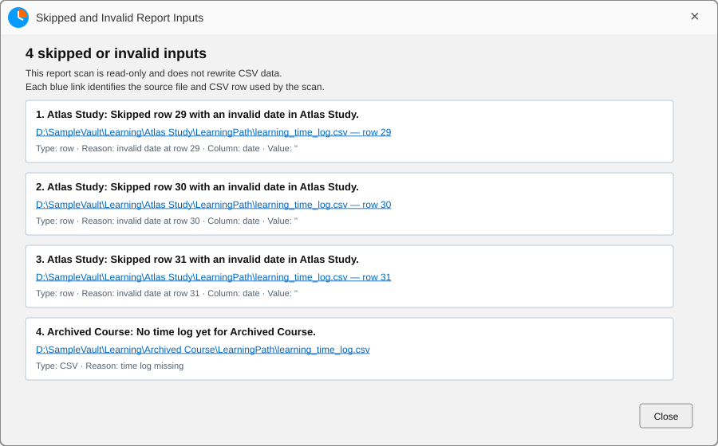

# LearningClock v6.0

LearningClock is a Windows-friendly Python/Tkinter desktop timer for tracking focused learning sessions. It records time across named study activities, page counts, session metadata, recovered emergency saves, and a recalculated CSV `TOTAL` row that can feed reports and documentation dashboards.

It is inspired by **dual timers chess clocks**. As soon as a player makes a moove stops his timer which starts his opponent timer. Similarly that Learning Clock has timers that track the different stages of learning. For example, I can start with reading, and as soon as hit the outlining timer, the reading timer stops and the outliner starts.

The project is intentionally small and operational: the GUI owns timer behavior, `CsvStore` owns persistence, tests protect the CSV contract, and `scripts/dev.py` provides repeatable lifecycle commands for development, QA, coverage, packaging, documentation export, and production release.

## Application And Dashboard

The desktop app presents learning timers that map directly to the persisted CSV activity columns. The refreshed view includes **Set Date** for backdated entries, **Add Page Count**, and the **View Progress** toggle.

### Version 6.0 LauncherPad

`learningclock-gui.exe` opens **LearningClock LauncherPad 2.0**. It discovers `D:\LearningClock\props\*.properties`, creates fully configured clocks through **Create New Clock**, and charts time by category across all valid clocks for this week, last week, this month, or a calendar-selected inclusive range. A linked skipped/invalid count opens read-only diagnostics with the exact source file, CSV row, column, value, and reason. Different clocks run as independent GUI processes. Each LearningClock owns a per-clock Windows named mutex for its whole lifetime, so a second process for the same configuration exits before CSV initialization.

From the repository, `dev launcherpad` starts the same source LauncherPad without
a console. `dev launcherpad-register` creates the current user's Windows Start
Menu entry with the LearningClock icon and requests **Pin to Start** when Windows
exposes that action.

The LauncherPad uses a high-contrast, full-canvas blue/orange clock icon with
native Windows sizes from 16 through 256 pixels for clear Start Menu display.
The same icon identifies the title bar at the top left of both LauncherPad and
every configured LearningClock window.

Clicking the underlined skipped/invalid count opens the read-only diagnostic popup. It identifies each affected clock, file, CSV row, column, rejected value, and reason; its blue file locations open the source or nearest existing directory.

Normal clock launch uses the `pythonExe` and `pyScriptPath` values in the central package-local `clock.properties`; per-clock files contain only `learning-path-name` and `logDir`. `logDir` is the clock's documentation-vault directory, while CSV files are stored under its `LearningPath` child. Application diagnostics are centralized under `D:\LearningClock\logs`. LauncherPad validates both runtime paths before starting the configured script and passes the CSV directory with `--log-dir`. Windows backslashes are literal because LearningClock uses its own UTF-8 `key=value` parser rather than Java escape rules.

### Version 5.3 interface

The v5.3 desktop interface uses bold menu and button labels for better visibility. Inactive activity controls are blue (`#069bff`); the running activity is orange (`#FF6600`). **Book Listening** is the current listening timer and persists as the `book_listening` CSV column. Existing `audiobook` data is retained through CSV normalization and migration.

**View Progress** opens the same CSV-based progress information inside the desktop app, beside the timers.

The single Obsidian dashboard at the vault root, `Learning-Clock-Dashboard.md`, discovers every clock CSV and provides an alphabetically sorted clock selector. Its only implementation remains under `Engineering/LearningClock/views/learning-clock-dashboard/view.js`; per-clock directories contain data, not dashboard copies.

## Categories

| Category | Purpose |
| --- | --- |
| Reading | Reading books, articles, docs. |
| Book Listening | Listening to technical learning material. |
| Outlining | Structuring notes, chapters, designs. |
| Active Recall | Recall practice, repetition, self-testing, and memory reinforcement. |
| Sandbox | Trial-and-error sandbox work, examples, prototypes, technology probes, and book/example exercises. |
| AI-Assisted Architecture & Design | Architecture, system design, modeling, tradeoff analysis, and design documentation performed through AI-assisted conversation. |
| AI-Assisted Engineering | Working with ChatGPT, CODEX, or other AI tools to generate, repair, design, document, test, or debug code. |
| Classical Software Engineering | Personally writing, modifying, refactoring, testing, debugging, and implementing code using traditional software engineering practices. |
| Update Documentation | Capturing stable knowledge in the documentation vault. |
| Promote Stable Concept | Turning stable ideas into reusable, publishable, or shareable concepts. |

“Sandbox” is for sandbox learning, trial-and-error, book examples, technology probes, prototype exploration, and trying things out before they become stable engineering work.

“AI-Assisted Engineering” is for time spent instructing ChatGPT, CODEX, or another AI assistant to generate, repair, explain, refactor, test, document, or debug code.

“AI-Assisted Architecture & Design” is for architecture, system design, modeling, tradeoff analysis, and design documentation performed through AI-assisted conversation.

“Classical Software Engineering” is for time spent directly implementing software yourself using traditional engineering practices: editing files, designing code, debugging in the IDE, running tests, refactoring, and fixing issues based on your own analysis.

## What Is Implemented

- Tkinter desktop timer with activity switching, stop/reset controls, manual time entry, and page-count entry.
- CSV persistence with a stable schema, canonical date formatting, activity-to-column mapping, page totals, and final aggregate `TOTAL` row.
- Existing CSV normalization for legacy dates and legacy field names.
- Emergency CSV save/recovery path for shutdown failures.
- Primary LauncherPad GUI with split central/per-clock configuration, transactional clock creation, running-state controls, independent process launch, and asynchronous cross-clock category reporting.
- Per-configuration Windows named-mutex protection inside LearningClock before persistence initialization.
- Semantic application-level logging, including structured LauncherPad, configuration, launch, mutex, runtime, and calendar events with cross-process correlation.
- Version-controlled LearningClock Seq workspace, saved tail query, Operations dashboard, and idempotent `dev seq-dashboard` installer.
- FastAPI readiness endpoint with automatic Swagger UI, ReDoc, and a tracked OpenAPI contract.
- Package CLI health check and version command.
- Compatibility launcher for the historical `learning-clock.py` entry path.
- Unit tests for CSV behavior and focused regression tests for real/app-style CSV inputs.
- Default `clock-QA` regression fixture under `build\Clock-QA` so the complete pytest suite runs without skipped CSV regression tests.
- HTML coverage generation through a convenience command.
- Markdown documentation source pages and export tooling.
- Production release script that deploys modules under `D:\LearningClock\Lib`, configuration under `props`, application logs under `logs`, and the icon under `assets`.

## Documentation

- [Requirements](docs/requirements.md)
- [Quick Start](docs/quick-start.md)
- [Usage](docs/usage.md)
- [Source Code Structure](docs/source-code-structure.md)
- [CSV Contract](docs/csv-contract.md)
- [Tests and Default Clock-QA Regression Fixture](docs/tests.md)
- [Coverage](docs/coverage.md)
- [Engineering Scorecard](https://javaboy-vk.github.io/LearningClock/)
- [Coverage Report](https://javaboy-vk.github.io/LearningClock/coverage/)
- [Convenience Commands](docs/convenience-commands.md)
- [Production Release, Packaging, and Generated Output Policy](docs/production-release.md)
- [VS Code Support](docs/vscode-support.md)
- [Application Logging](docs/application-logging.md)
- [LauncherPad Architecture and Operations](docs/launcherpad.md)
- [HTTP API, Swagger UI, and OpenAPI Export](docs/api.md)
- [Automated Code Inventory](docs/code-inventory-automation.md)

## Code Inventory

The GitHub Pages workflow generates the repository-wide inventory without modifying the repository. It uses the same blue Pygount table format as the Engineering Scorecard and covers the complete Git-tracked LearningClock workspace.

[Open the LearningClock Engineering Scorecard](https://javaboy-vk.github.io/LearningClock/) for the Application Source, Tests and Benchmarks, Documentation, and DevOps breakdown, together with tests, coverage, performance, benchmarks, and documentation sections.
