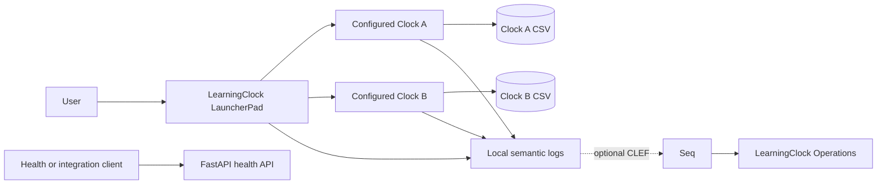
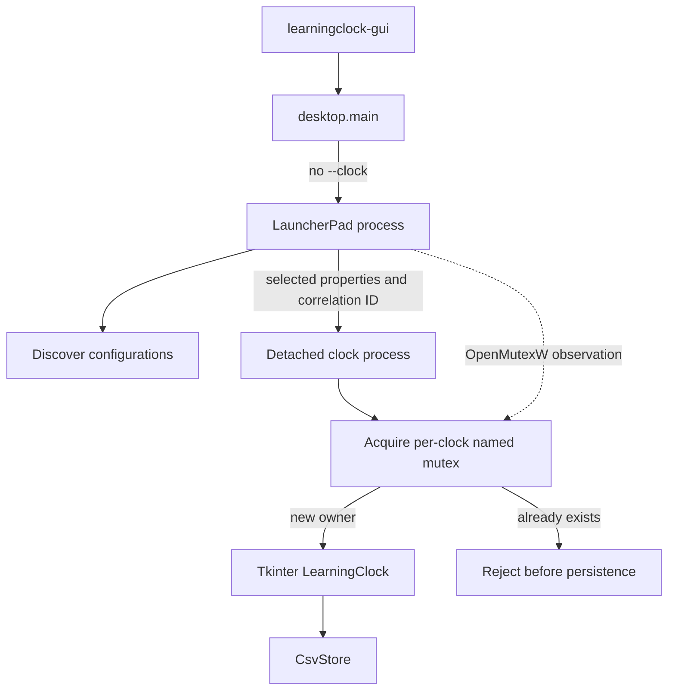
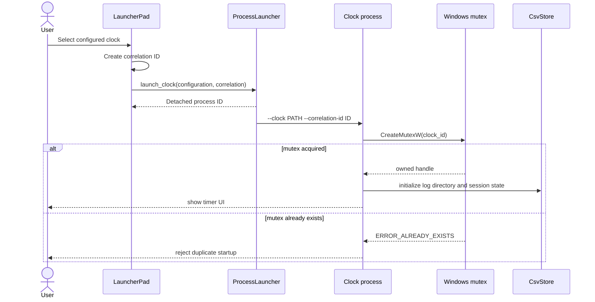
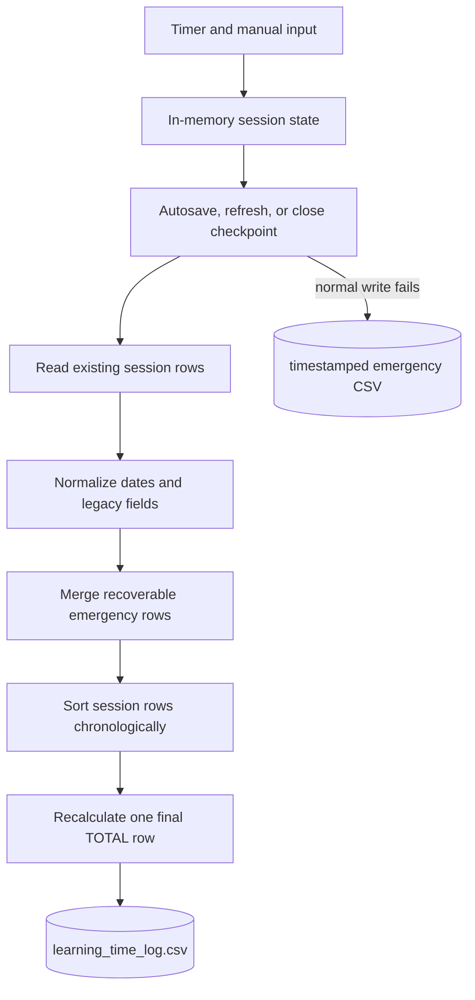
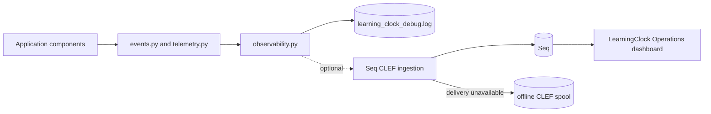

# LearningClock 6.0 Architecture Diagrams

**Product Release:** 6.0  
**Document Revision:** R1  
**Document Version:** 6.0.R1

## System context

## Runtime process model

## Launch and singleton sequence

## Persistence flow

## Observability flow

Dashed Seq paths are optional. A dashboard event confirms received telemetry;
it does not confirm that a clock owns a mutex or that CSV persistence succeeded
unless the corresponding structured event is present.
