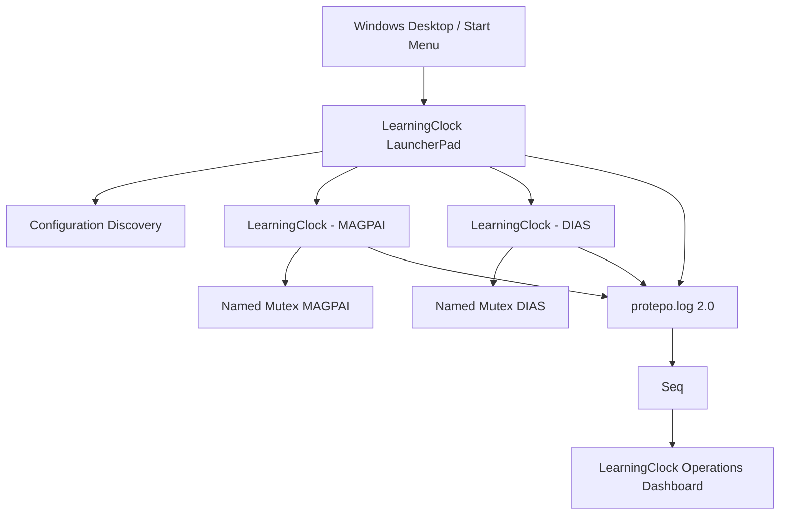

# LauncherPad Architecture and Operations

LearningClock v6.0 replaces the former per-clock shortcut path:

```text
Desktop shortcut -> Learning-clock.vbs -> pythonw.exe -> app.py -> one configuration
```

The production path is now:

```text
Desktop / Start Menu -> learningclock-gui.exe -> LauncherPad
                                             -> LearningClock process --clock <properties>
```

No VBS, WScript, CScript, CMD, or PowerShell process participates in normal GUI startup.

## Responsibilities

- `configuration.py` discovers and validates `.properties` files. `learning-path-name` and `logDir` are required. Optional `clock-id`, `display-name`, and `order` extend the existing schema without invalidating old files.
- `singleton.py` is the data-integrity boundary. LearningClock calls `CreateMutexW` with `Local\Protepo.LearningClock.<clock-id>` before creating `CsvStore`, timer state, or session state. `ERROR_ALREADY_EXISTS` rejects a duplicate. Normal close calls `ReleaseMutex` and `CloseHandle`; process termination lets Windows remove the final handle automatically.
- `launcherpad.py` calls `OpenMutexW` every 1.5 seconds. It only observes, closes the observation handle immediately, and maps existence to a disabled orange `— Running` control. Stable polling creates no information-level telemetry; only state transitions do.
- `process_launcher.py` launches list-form commands with `shell=False`, detached Windows process flags, closed inheritable handles, and standard streams attached to `DEVNULL` rather than pipes. LauncherPad stores no child-process ownership and never terminates clocks.
- `desktop.py` is the one GUI entry point. With no internal arguments it opens LauncherPad; `--clock <properties>` runs the selected LearningClock in a separate process.



LearningClock owns mutexes; LauncherPad observes them. Seq receives telemetry but never determines runtime ownership.

## Source and packaged execution

Source mode selects `pythonw.exe` beside the currently active interpreter and runs `-m learningclock.desktop`. This respects the repository virtual environment without hard-coded Python installations. Each clock starts in a detached process group and breaks away from the LauncherPad/VS Code Windows job, so closing LauncherPad cannot terminate it. The wheel defines the Windows GUI entry point `learningclock-gui`; the generated executable opens no console. A frozen `LearningClock.exe` is also supported: it relaunches itself with the internal `--clock` argument.

Use the repository commands for source startup and current-user Start registration:

```cmd
dev launcherpad
dev launcherpad --config-dir D:\LearningPath
dev launcherpad-register
```

`launcherpad-register` creates or updates **LearningClock LauncherPad** under the
current user's Start Menu, targets the repository `.venv\Scripts\pythonw.exe`,
uses `launcher\Learning-Clock.ico`, and requests **Pin to Start**. Windows may
require the final pin to be selected manually from the registered Start entry.

The LauncherPad icon uses a high-contrast dark tile, a full-size blue/orange
clock face, and thick white hands instead of the former miniature UI screenshot.
`launcher\Learning-Clock-source.png` is the transparent master artwork;
`scripts\Build-LauncherIcon.ps1` builds native 16 through 256 pixel frames into
`launcher\Learning-Clock.ico` and synchronizes the packaged copy under
`src\learningclock\assets`. The shared window-icon helper applies that asset at
the top left of both the LauncherPad and configured LearningClock title bars,
so Windows does not have to shrink one pale image or show Tk's generic icon.

The setuptools wheel remains the repository's packaging mechanism; PyInstaller was not introduced. `dev release` stages the icon and complete `learningclock` package under `D:\LearningPath\Tools\LearningClock`. Install the built wheel into the production environment to create `learningclock-gui.exe`.

## Calendar regression

The Set Date action originally revealed only the date field; it did not invoke the custom calendar until the embedded icon was clicked. The transient `Toplevel` could also remain unmapped or behind its parent on Windows. Set Date now schedules the calendar immediately after the field is laid out, and the popup is retained, deiconified, raised, visibility-synchronized, focused, and only then given the input grab. The icon, `Alt+Down`, and `F4` reopen it. Date parsing and CSV behavior are unchanged.

## Acceptance checks

1. Start LauncherPad and confirm all valid `D:\LearningPath` configurations appear.
2. Launch two different clocks; confirm separate processes and orange disabled controls.
3. Close and restart LauncherPad; clocks continue and are reconstructed from mutex observation.
4. Attempt the same clock directly; confirm the duplicate exits before CSV initialization.
5. Terminate a clock; confirm its control becomes available and can immediately relaunch.
6. Open Set Date and confirm the calendar appears above the clock and applies a selected date.

These GUI/process-tree scenarios require an interactive Windows desktop. Automated tests cover configuration, command construction, button mapping, real subprocess mutex ownership/cleanup, v2 telemetry, and dashboard contracts.
